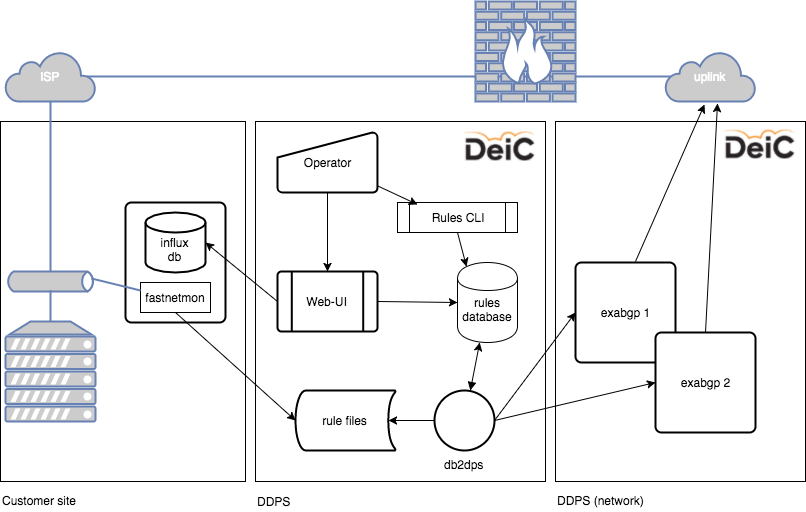

# DeiC Distributed Denial of Service Attack Prevention System, DDPS

DDPS stands for _DeiC Distributed Denial of Service Attack_ and it has been built for the Danish
research network, DeIC. The [full vision statement is available here](docs/vision.md).

DDPS is conceived as an automated system for DDoS mitigation: detected attacks automatically create mitigation rules. Additionaly, end-users may add, edit, or cancel mitigation rules as well as view archived rules and statistical information.

The project is hosted on github.com and split in a number of sub-projects. This is
the documentation hub.

## Short technology overview

DDoS mitigation based on BGP Flowspec requires some rules to _enter_ the
system, and other rules to be _sent to and enforced by peering partners and
upstream provider_. The drawing illustrates the different components: to the
left is a customer site where the detection engine (using fastnetmon) monitors traffic to a group of networks
and logs traffic statistics to a local influx database.       
When an attack is detected, a set of mitigation rules are generated and sent to DDPS via an encrypted channel. The rules are added to an database and announced as flowspec rules in the BGP session. This means that they are both sent to upstream networks and disseminated accross the network to edge routers. The rules are enforced on
edge on the routers thereby mitigating the attack. Rules are later withdrawn.

<!--
	the image is made in Draw.io (chrome app), the src is in media/docs/workflow.xml
-->

The rules have to match the BGP community we are responsible for: they have to match
our network only. The system has been designed to do that from the entrance point
to the exit point: customers can only make rules for their own network which is
a subset of ours, and the system can only send rules upstream which matches our
network as such.

Rules are made up of the 12 fields defined in
[RFC5575](https://tools.ietf.org/html/rfc5575) and
[RFC7674](https://tools.ietf.org/html/rfc7674) with a start and expire time
together with some customer information.

Rules are added to the system from two sources:

  - a *policy editor* operated by the customer
  - an *automatic detection engine* based on
    [fastnetmon](https://github.com/pavel-odintsov/fastnetmon)

Rules are uploaded to the database server and added to a
[postgres](https://www.postgresql.org) database. A daemon queries the database
for new and expired rules. The daemon converts the rules to BGP flowspec
announce and withdraw rules and inserts them in two
[exabgp](https://github.com/Exa-Networks/exabgp) instances from where they are
sent to our edge routeres, peers and upstream provider.

## Contact and Contributing

If you would like help implementing DDPS then please have a look at the
[contributing](docs/contributing.md) page. If you would like to contact
the team behind DDPS then send an email to [ddps@deic.dk](mailto:ddps@deic.dk)

## Find out more

  - [Project Proposal for version 1.0 / what does DDPS solve and with what limitations](docs/DDoS_Detection_and_Mitigation_Service_MB.md) (in Danish only)
  - [Technical Design for version 1.0](docs/DDPS-technical-documentation.md)
  - TODO: [System Documentation](docs/stubfile.md)
  - TODO: [Link to the other github projects with actual code](docs/stubfile.md)
  - TODO: [Todo / Road map](docs/stubfile.md)
  - [Status](docs/status-notes.md) for version 1.0
  - TODO: [FAQ](docs/stubfile.md)
  - TODO: [Known issues](docs/stubfile.md)
  - How to get support / Contact information: please write to [ddps@deic.dk](mailto:ddps@deic.dk)

## License

DDPS is copyright 2015-2017 DeiC, Denmark

Licensed under the [Apache License, Version 2.0](http://www.apache.org/licenses/LICENSE-2.0)
(the "License"); you may not use this software except in compliance with the
License.

Unless required by applicable law or agreed to in writing, software distributed
under the License is distributed on an "AS IS" BASIS, WITHOUT WARRANTIES OR
CONDITIONS OF ANY KIND, either express or implied. See the License for the
specific language governing permissions and limitations under the License.

TODO:

  - clean up files in doc etc.
  - rewrite most of it,
  - remove what is no longer needed

