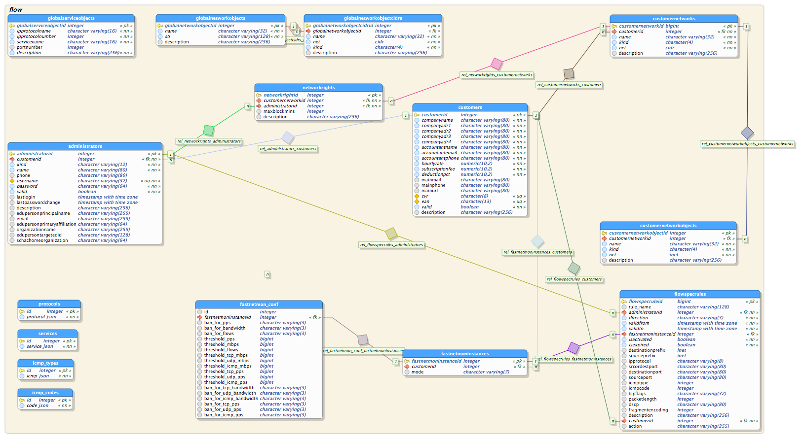

# Deic DDoS Protection System - DPS

The following describes the _DeiC project DDoS Protection System_ which is a
self-service and automatic DDoS mitigation system, version 1.0.

## Introduction
The system consists of two parts:

  - a _self service portal_ where an administrator may create ad-hoc block rules
    based on pre-defined services and network
  - an _automated system_ which detects predefined abnormalities and
    implements mitigation based on a specific configuration

While there is _only one self service portal_, there may be more than one
automated system each covering a specific number of networks. The automated
system(s) is intended to be placed at the customer site.

All system injects mitigation rules into the same central database, which is
polled for new rules once a minute. Rules are logged uniquely with as much
information on when and who or what instance created the rule. Access to the
database is restricted.

Rules are enforced using incremental updates on two different instances of
[exabgp](https://github.com/Exa-Networks/exabgp). If an exabgp instance needs
restart, it may query the database for a full configuration. Using two exabgp
instances for the announcement makes the system more resilient and hopefully 
prevents sending a full state update to the uplink when the exabgp restarts.

Rules may be defined fine-grained as of [rfc5575](https://tools.ietf.org/html/rfc5575)
except that the source all ways is _any_. The rules may be enforced either as
_flow spec rules_ taking full advantage of the granularity or when that is not
possible as rate limit or black hole routing as a final course of action.

The database layout is shown below:

## Focus in version 1.0

  - Self service web-based interface for creating scheduled ad-hoc block rules
    with access limited to trusted technicians and their networks
  - Automatic DDoS detection and mitigation based on the [git hub version of
    fastnetmon](https://github.com/pavel-odintsov/fastnetmon)
  - Store automatic and self service rules in a database, together with
    customer subnets, administrator access etc.
  - [Implementation](http://www.codingthearchitecture.com/2010/03/23/fail_safe.html)
    of bare-bone functionality for [fail
    safe](https://en.wikipedia.org/wiki/Fail-safe) DDoS mitigation:
	- Inbound [BGP flowspec](https://tools.ietf.org/html/rfc5575) rules for
	  destination addresses only
	- Implementation of BGP flowspec in new DeiC equipment only, optionally
	  DeiC upstream also,
	- Implementation of
	  [black hole - route](https://en.wikipedia.org/wiki/Black_hole_(networking))
	  and [rate - limit](https://en.wikipedia.org/wiki/Denial-of-service_attack)
	  on source - addresses on upstream and current DeiC equipment

Notice that the current network equipment used by DeiC does not support BGP
flowspec. New equipment is due to be installed in the fall of 2016.

## The (potential) customers with access

The potential customers for the self service system include the following:

  - Deic netdrift and on-call personnel
  - network technicians employed at customers for the danish research network
  - network technicians employed at Its learning and other customers with
    identical needs

The automated system may be deployed in front of a number of customers
network but will be operated solely by members of the DeiC network team.

## Database design
The database operates with different _customers_ and their _networks_. A
customer cannot add new network but only subnet their existing networks.

Each customer user may have one of to different roles; as either
_database administrator_ or _network administrator_.

The database administrator may add new network administrators, while the
network administrator may create services, subnets and rules. Contact
information etc. may be edited by the customer as well.

All relevant transactions in the database is logged, so e.g. the creation of a
rule has both time stamp and network administrator well as the customer name on
it.

The database is build on [postgres](https://www.postgresql.org/about) which has
[cidr](https://www.postgresql.org/docs/9.1/static/datatype-net-types.html) as a
build-in data type. Data types and constraint are used actively when possible
to avoid mistakes with the stored information. Validation also takes place in
the GUI and before adding information.

All common protocols and services are predefined in the database, but customers
may add their own service objects as defined in
[rfc5575](https://tools.ietf.org/html/rfc5575) including port numbers, packet 
size and IP protocol but not source IP address or other destination IP address
not within the customers scope.

To sum up:

  - A customer is created with a _database administrator_, _customer networks_,
    and general contact information.
  - The customers _database administrator_ may _subnet the customer networks_ 
	and create _network administrators_, and grant them access to all or
	specific subnets and change contact information etc.
  - The customers _network administrator_ may create _rules_ and _service objects_
    for the services which has not been defined globally.

## Web GUI for the self service portal
The self service portal enables _network administrators_ to create inbound
block rules for their own network and IP addresses based on the 12 flow
specification parameters except the source, which is always _any_ and the
destination which is always one of the customers
own CIDR.

<html>
 &nbsp;
</html>
## Rule creation
Rules are made using a php-driven web-based GUI. The rules has a start- and
end-time and follows [rfc5575](https://tools.ietf.org/html/rfc5575). The
creator and the creation time for each rules is logged as well.

Each customer may view their own current and previews rules.

The current version of the GUI looks this way:

## Rule injection from fastnetmon
Fastnetmon calls a script with 4 parameters and further information on stdin; this
script extract what ever possible information and - if all fields are passed
correctly - inserts a rule in the database using a secure shell connection.

## Extracting the rules from the database
The database is queried once a minute for rules which must be implemented.
Once the rules has been handed over to the two exa-bgp instances, the database
is updated with information on which rules has been enforced.

If a exabgp instance needs restarting the database is queried for all rules
which must be implemented, as the rules are not persistent to exabgp. A
configuration file for exabgp is created with information from the database and
exabgp is re-started.

When exabgp restarts it may flood the upstream with its configuration rather
than just send updates as it will do in normal production. While it is unlikely
that the upstream will be flooded, prefix limits must be in place on both the
upstream and the next hop equipment.

## Fail safe implementation

The following parameters has been used to make the system fail safe:

  - fastnetmon / automatic mitigation: rules are only injected in the database
    if all parameters passes rigid checks including valid addresses and port
    numbers,
  - the self service portal only accept valid input for all defined fields
  - prefix limits in exabgp prevents flooding and non-DeiC network rules to the
    upstream
  - BGP community RTBH is enforced

### Limitations

This is an early stage of version 1.0; we do not have the required network
equipment for DeiC yet.

  - fastnetmon does not log ICMP code and type during an attack, and automatic 
    detection is limited to its capabilities.
  - access to the self service system may be limited from the customer site during
    an attack. This may be mitigated by reserving band width in the customer's
	router or by adding access from a third party network (LTE/3G modem), thereby
	requiring VPN.

## Status

  - The GUI is not yet finished and does not enforce check on all parameters
  - Limitations for the server which hosts the first fastnetmon has not been tested
    fully yet. It is expected to monitor up to 10G line speed.
  - Creating the exabgp configuration from the database is missing
  - Syntax check in output from the database to exabgp for ad-hoc update is missing

There is most probably something more missing before a version 1.0 will go into
testing: deployment has not been addressed yet, certificates and access limitations
just to mention a few: none of which is rocket science but need a solution.

### Document information

Version: 1.0 ($Id: bdbc2bd35d99f92f7e24e3d8aabd19db0349043d $)

Author(s): Niels Thomas Haugård & Nicolai Ernst

