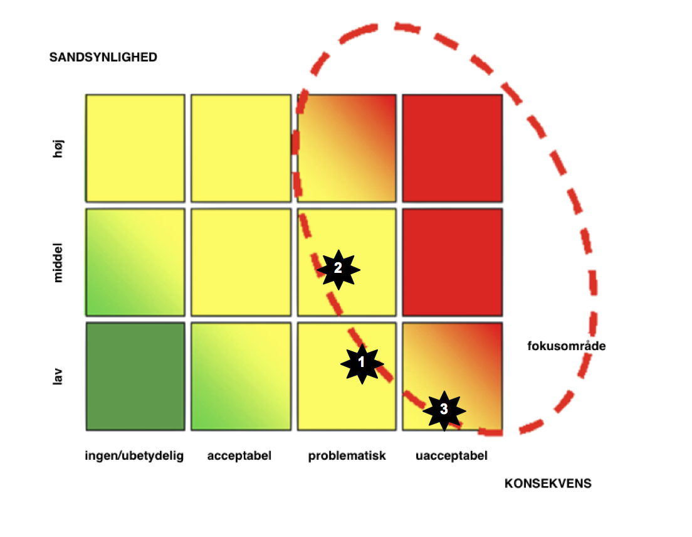

# DeiC Distributed Denial of Service Attack Prevention System, DDPS

Tekst af 20. Maj 2016 konverteret uden ændringer i teksten fra docx til
markdown.

## Projektets vision

Institutioner på Forskningsnettet bliver beskyttet mod DDoS angreb:

  - hurtigere (1), da ramte institutioner selv kan skabe og disseminere
    filters for trafik flows til og fra deres adresser;
  - hurtigere (2), fordi systemet vil bruge effektivt monitering af
    flows;
  - på en mere brugervenlig måde, da deres input vil ske på en dedikeret
    webportal, hvor reglerne vil kunne skabes og administreres
    uafhængigt af det specifik hardware, hor de vil implementeres;
  - på en mere overskuelig måde, da webportalen vil også bruges til at
    tjekke, ændre og slette eksisterende regler.

## Beskrivelse af projektet og idéen bag

Med den DDoS Detection and Mitigation Service som bliver beskrevet i dette
dokument vil brugere på slutinstitutioner selv kunne skabe og udbrede firewall
regler via en webportal. Reglerne bliver også mere præcise, da tjenesten vil
bruge BGP FlowSpec (RFC 5575), hvor specifikke flows kan stoppes uden at
blokere hele trafikken.

### Brugere og værdiskabelse

Målgruppen for projektet er primært personale på institutioner som er
tilsluttet til forskningsnettet og som har ansvar for firewall og
sikkerhed. Deres behov er enkelt: de skal kunne tilbyde netadgang døgnet
rundt og derfor imødegå DDoS angreb.

### Unik tilgang

Tilgangen er unik på grund af:

  - teknologi (brug af BGP FlowSpec);
  - organisation (samarbejde mellem institutioner og forskningsnet
    drift organisation).

#### På organisatorisk/workflow plan

Der er forskellige typer DDoS angreb. I det tilfælde en institution bliver ramt
af volumetriske angreb, skal trafik helst blokeres ”upstream”, da det kan nemt
overbelaste en institutions uplink.  Samtidigt er det ikke altid muligt at
detektere disse flows på netværkets core routere. Projektet går ud på at
kombinere lokal monitering af flows og manuelle input fra brugere på den ramte
institution via en webportal til at kommunikere og implementere hurtigt
firewall regler også på upstream routere.

#### På teknologisk plan
I forhold til alternative teknologer (f. eks. RTBH) kan FlowSpec Regler bruges
til at blokere specifikke flows, men andre flows stadig kan nå den ramte IP
adresse/tjeneste.

DDoS-beskyttelse af enkelte tjenester kan købes som en service (ved at man
lader disse tjenester være proxy for tjenesten), men DDoS-beskyttelse skal
implementeres, så det gælder hele nettet, er det kun noget netoperatøren (her
Forskningsnettet) kan gøre.

#### Fordele og omkostninger

Ved at mindske DDoS angreb omfang med en hurtigere og mere præcis
modforanstaltning vil man begrænse downtime for tjenester og netadgang
og dermed spare tid og penge.

For driftsansvarlige og firewall administratorer vil det centrale
webportal også mindske den tid, som bliver brugt i dag til at
konfigurere og administrere firewall regler og ACL.

#### Konkurrenter og alternativer

Der er forskellige kommercielle udbydere af DDoS protection. Man kan
skelne mellem:

  - _on-premise DDoS protection:_        
	On-premise DDoS protection er hardware baserede løsninger. De bliver for
	eksempel tilbudt af Arbor Networks. For at være effektivt mod volumetriske DDoS
	angreb skal on-premise DDoS protection kunne kommunikere med routere som er
	lokaliserede upstream eller placeres ved coren af netværket. Ved coren af
	netværket er det til gengæld vært at identificere og dermed at blokere for
	andre typer DDoS angreb som applikation layer angreb. En anden begrænsning er,
	at disse løsninger bruger tit ”route blackholing”, som blokerer al trafik til
	det ramte institution/tjeneste

  - _Cloud-based DDoS Protection:_        
	Firmaer som Incapsula, Cloufare eller Akamai tilbyder skybaserede kommercielle
	løsninger. Disse tjeneste bruge DNS caching og content delivery networks til at
	beskytte mod DDoS angreb. Disse løsning er meget effektive, hvis man skal
	beskytte et begrænset antal hjemmesider.

Disse løsninger har det tilfælles at de er dyre, hvis man skal beskytte
institutioner som universiteter. For eksempel starter priserne typisk for en
skybaseret løsning ved 100 kr. pr. hjemmeside pr. måned og 35000 kr. pr. måned
for en enterprise løsning). Det vil derfor være rigtig dyrt at implementere en
af disse løsning for en bred beskyttelse på forskningsnettet.

## Mål

### Formål

Projektet skal gennemføres så institutioner på forskningsnettet
beskyttes effektivt mod DDoS angreb.

### Delmål

| **ID**  |  **Leverance**                          |                          **Beskrivelse** |
|---------|-----------------------------------------|------------------------------------------|
|  1      | Implementering af BGP FlowSpec          |                         Implementering af BGP FlowSpec på forskningsnettet. Målet et at kunne sende BGP FlowSpec regler til Forskningsnettets core route routere og at disse regler bliver aktiveret. |
|  2      | Udvikling af en webportal til administration af FlowSpec Regler | En webportal bliver udviklet, hvor autoriserede IT administrator på institutioner kan skabe og administrere FlowSpec Regler for trafik til eller fra de IP adresser, som er allokerede til deres institution. Disse regler bliver kommunikeret til forskningsnettet routere. |
|  3      | Flow-baseret detektering system for DDoS angreb          |        En detektering infrastrucktur bliver implementeret ved institutioner til at automatesere detektering af DDoS angreb (1) og (2) til at automatesere skabelse af FlowSPec regler (ved implementering af FastNetMon eller en tilsvarende løsning) |
|  4      | Udbredelse af FlowSPec regler til Nordunet               |        FlowSpec regler skabt og administreret på forskningsnettet bliver udbredte og aktiveres på vores upstream netværk Nordunet |

### Succeskriterier

Ovenstående delmål er implementeret og testet, og DeIC og
aftagerorganisationerne finder systemet egnet og stabilt.

DDoS angreb bliver hurtigere imødegået.

## Baggrund

### Problemformulering

Ifølge Symantec og andre vokser det antal DDoS angreb i verden[^1] og
disse angreb rammer også uddannelses- og forskningsinstitution. I
december 2015 blev f.eks. det britiske forskningsnet JISC udsat for
systematiske DDoS angreb[^2]. Kommercielle internetlevandører har
forstået, hvor vigtigt DDoS beskyttelse er, og er begyndt at udbyde
det[^3].

I en kontekst hvor de kommercielle løsninger er dyre og ikke
nødvendigvis tilpassede forskningsverden er det vigtigt at DeIC kommer
med en løsning for at beskytte mod DDoS angreb.

### Sammenhæng med DeICs strategi

Beskyttelse mod DDoS angreb er vigtigt så DeIC kan udføre sin mission og
sikre adgang til e-infrastruktur. En af DeICs opgaver er nemlig at
“stabil operativ leverance af e-infrastruktur”. Og det kan man ikke,
hvis tjenester og institutioner er ikke online.

### Sammenhæng med andre projekter og tjenester

Projektet skal udvikles I samarbejdet med netdrift, så DDoS beskyttelse
bliver integreret i den daglige drift af netværket.

Projektet kræver også et godt samarbejde med vores upstream netværk
Nordunet og GÉANT, så det kan udføres med succes.

## Interessenter

| Interessent | Rolle I projektet | Succes-kriterier | Bidrag | Interessekonflikt | Forholdsregler |
|-------------|-------------------|------------------|--------|-------------------|----------------|
| DeIC        | Udvikler          | Udvikler webportalen og implementere løsning  |                |
| Tilsluttede institutioner | Brugere | DDoS angreber bliver mitigeret | Feedback |                |
| Nordunet | Udbredelse af FlowSpecregler I upstreamnetværk |  | Udbredelse og aktivering af FlowSpecregler fra DeIC I Nordunet | | |
| GÉANT | Udbredelse af FlowSpecregler I upstreamnetværk | | Udbredelse og aktivering af FlowSpecregler fra DeIC I GÉANT | |

## Foreløbig grovplan

<html>
<table>
	<tbody>
		<tr>
			<td>
				<strong>Fase</strong></td>
			<td>
				<strong>Aktivitet</strong></td>
			<td>
				<strong>Forventet starttidspunkt </strong></td>
			<td>
				<strong>Forventet sluttidspunkt</strong></td>
		</tr>
		<tr>
			<td>
				Planl&aelig;gning</td>
			<td>
				1. General arkitektur med flows</td>
			<td>
				&nbsp;</td>
			<td>
				&nbsp;</td>
		</tr>
		<tr>
			<td>
				&nbsp;</td>
			<td>
				2. Definition af rollene og autoriserings mekanisme</td>
			<td>
				&nbsp;</td>
			<td>
				&nbsp;</td>
		</tr>
		<tr>
			<td>
				&nbsp;</td>
			<td>
				3. Definition af specifications for webportalen</td>
			<td>
				&nbsp;</td>
			<td>
				&nbsp;</td>
		</tr>
		<tr>
			<td>
				&nbsp;</td>
			<td>
				4. Udvikling af webportalen</td>
			<td>
				&nbsp;</td>
			<td>
				&nbsp;</td>
		</tr>
		<tr>
			<td>
				&nbsp;</td>
			<td>
				5. Set-up af test-bed</td>
			<td>
				&nbsp;</td>
			<td>
				&nbsp;</td>
		</tr>
		<tr>
			<td>
				&nbsp;</td>
			<td>
				6. Test af detektering l&oslash;sning (FastNetMon)</td>
			<td>
				&nbsp;</td>
			<td>
				&nbsp;</td>
		</tr>
		<tr>
			<td>
				&nbsp;</td>
			<td>
				7. Test af webportalen og detektering l&oslash;sning mod testbed</td>
			<td>
				&nbsp;</td>
			<td>
				&nbsp;</td>
		</tr>
		<tr>
			<td>
				&nbsp;</td>
			<td>
				8. Test med simulering af angreb i testbed</td>
			<td>
				&nbsp;</td>
			<td>
				&nbsp;</td>
		</tr>
		<tr>
			<td>
				Implementering</td>
			<td>
				1. Aktivering af BGP p&aring; core routere</td>
			<td>
				&nbsp;</td>
			<td>
				&nbsp;</td>
		</tr>
		<tr>
			<td>
				&nbsp;</td>
			<td>
				2. Kommunikation mellem webportalen og core routere</td>
			<td>
				&nbsp;</td>
			<td>
				&nbsp;</td>
		</tr>
		<tr>
			<td>
				&nbsp;</td>
			<td>
				3. Deployment af FastNetMon instanser</td>
			<td>
				&nbsp;</td>
			<td>
				&nbsp;</td>
		</tr>
		<tr>
			<td>
				&nbsp;</td>
			<td>
				4. Udbredelse af FlowSpec regler i Nordunet og G&Eacute;ANT</td>
			<td>
				&nbsp;</td>
			<td>
				&nbsp;</td>
		</tr>
		<tr>
			<td>
				Evaluering</td>
			<td>
				1.</td>
			<td>
				&nbsp;</td>
			<td>
				&nbsp;</td>
		</tr>
		<tr>
			<td>
				&nbsp;</td>
			<td>
				&nbsp;</td>
			<td>
				&nbsp;</td>
			<td>
				&nbsp;</td>
		</tr>
		<tr>
			<td>
				&nbsp;</td>
			<td>
				&nbsp;</td>
			<td>
				&nbsp;</td>
			<td>
				&nbsp;</td>
		</tr>
	</tbody>
</table>
</html>

Når projektet er godkendt skal en egentlig tidsplan, med milepæle og
tidsmæssigt overskuelige aktiviteter udarbejdes, og fremlægges for
projektets styregruppe.

Det forventes at projektet i denne første udgave fører til en første
udgave af en fungerende tjeneste. Det forventes at tage ca. 1
kalenderår, således at afslutningen af projektet i dette forslag kommer
til at ligge midt i 2017.

## Projektgruppe

<html>
<table border="1" cellpadding="0" cellspacing="0">
	<tbody>
		<tr>
			<td>
				<strong>Projektrolle</strong></td>
			<td>
				<strong>Ansvar for</strong></td>
			<td>
				<strong>Navn</strong></td>
			<td>
				<strong>Mail </strong></td>
			<td>
				<strong>Mobil</strong></td>
			<td>
				<strong>Institution</strong></td>
		</tr>
		<tr>
			<td>
				Projektleder</td>
			<td>
				&nbsp;</td>
			<td>
				Tangui Coulouarn</td>
			<td>
				<a href="mailto:Tangui.coulouarn@deic.dk">Tangui.coulouarn@deic.dk</a></td>
			<td>
				2523 4217</td>
			<td>
				DeIC</td>
		</tr>
		<tr>
			<td>
				Projektdeltager</td>
			<td>
				Udvikler</td>
			<td>
				Nicolai B. Ernest</td>
			<td>
				<a href="mailto:nice@dtu.dk">nice@dtu.dk</a></td>
			<td>
				35 88 82 82</td>
			<td>
				DeIC/I2</td>
		</tr>
		<tr>
			<td>
				Projektdeltager</td>
			<td>
				Udvikler</td>
			<td>
				Niels Thomas Haug&aring;rd</td>
			<td>
				<a href="mailto:ntha@dtu.dk">ntha@dtu.dk</a></td>
			<td>
				35 88 82 81</td>
			<td>
				DeIC/I2</td>
		</tr>
		<tr>
			<td>
				Projektdeltager</td>
			<td>
				Drift og implementering</td>
			<td>
				Anders Mundt Due</td>
			<td>
				<a href="mailto:Anders.mundt.due@deic.dk">Anders.mundt.due@deic.dk</a></td>
			<td>
				3588 8227</td>
			<td>
				DeIC</td>
		</tr>
		<tr>
			<td>
				Projektdeltager</td>
			<td>
				Udvikling af webportalen</td>
			<td>
				Kasper Mogensen</td>
			<td>
				<a href="mailto:Kasper.mogensen@deic.dk">Kasper.mogensen@deic.dk</a></td>
			<td>
				2341 0901 
				&nbsp;</td>
			<td>
				DeIC/I2</td>
		</tr>
		<tr>
			<td>
				Samarbejdspartner</td>
			<td>
				Udbredelse af FlowSpec regler i Nordunet</td>
			<td>
				Fredrik Korsb&auml;ck</td>
			<td>
				<a href="mailto:hugge@nordu.net">hugge@nordu.net</a></td>
			<td>
				&nbsp;</td>
			<td>
				Sunet/Nordunet</td>
		</tr>
		<tr>
			<td>
				Samarbejdspartner</td>
			<td>
				Udbredelse af FlowSpec regler i G&Eacute;ANT</td>
			<td>
				Evangelos Spatharas</td>
			<td>
				<a href="mailto:Evangelos.Spatharas@geant.org">Evangelos.Spatharas@geant.org</a></td>
			<td>
				&nbsp;</td>
			<td>
				G&Eacute;ANT</td>
		</tr>
	</tbody>
</table>
</html>

## Ressourcer og økonomi

### Projektbudget

<html>
<table border="1" cellpadding="0" cellspacing="0">
	<tbody>
		<tr>
			<td>
				<strong>Aktiviteter</strong></td>
			<td>
				<strong>Budget</strong> 
				(timer)</td>
			<td>
				<strong>Budget</strong> 
				(DKK)</td>
		</tr>
		<tr>
			<td>
				Fase: Planl&aelig;gning 
				&nbsp;</td>
			<td>
				100</td>
			<td>
				63.000</td>
		</tr>
		<tr>
			<td>
				Fase: Implementering 
				&nbsp;</td>
			<td>
				200</td>
			<td>
				126.000</td>
		</tr>
		<tr>
			<td>
				Fase: Aflevering og evaluering 
				&nbsp;</td>
			<td>
				50</td>
			<td>
				31.500 
				&nbsp;</td>
		</tr>
		<tr>
			<td>
				Projektledelse 
				&nbsp;</td>
			<td>
				50</td>
			<td>
				31.500</td>
		</tr>
		<tr>
			<td>
				&Oslash;vrige omkostninger (fx til hardware/software)</td>
			<td>
				&nbsp;</td>
			<td>
				200.000</td>
		</tr>
		<tr>
			<td>
				Sum</td>
			<td>
				400</td>
			<td>
				452.000</td>
		</tr>
		<tr>
			<td>
				Internationalt udviklingsprojekt med NORDUnet og G&Eacute;ANT (under foruds&aelig;tning af accept fra de andre parter)</td>
			<td>
				500</td>
			<td>
				208.000</td>
		</tr>
		<tr>
			<td>
				Total</td>
			<td>
				900</td>
			<td>
				660.000</td>
		</tr>
	</tbody>
</table>
</html>

Udfyldes med de aktiviteter, der er skitseret I tidsplanen, samt
øvrige forventede omkostninger undervejs.

Baseret på overstående ressourceestimat er den estimerede pris for
projektet DKK \[XX.000\] excl. moms.

### Forventede omkostninger til drift efter projektets gennemførelse

<html>
<table border="1" cellpadding="0" cellspacing="0">
	<tbody>
		<tr>
			<td>
				<strong>Ydelser</strong></td>
			<td>
				<strong>Budget</strong> 
				(timer)</td>
			<td>
				<strong>Budget</strong> 
				(DKK)</td>
		</tr>
		<tr>
			<td>
				Drift</td>
			<td>
				&nbsp;</td>
			<td>
				&nbsp;</td>
		</tr>
		<tr>
			<td>
				Sum</td>
			<td>
				&nbsp;</td>
			<td>
				&nbsp;</td>
		</tr>
		<tr>
			<td>
				Support</td>
			<td>
				&nbsp;</td>
			<td>
				&nbsp;</td>
		</tr>
		<tr>
			<td>
				Sum</td>
			<td>
				&nbsp;</td>
			<td>
				&nbsp;</td>
		</tr>
		<tr>
			<td>
				&Oslash;vrige omkostninger (fx til hardware/software)</td>
			<td>
				&nbsp;</td>
			<td>
				&nbsp;</td>
		</tr>
		<tr>
			<td>
				Sum</td>
			<td>
				&nbsp;</td>
			<td>
				&nbsp;</td>
		</tr>
		<tr>
			<td>
				Total</td>
			<td>
				&nbsp;</td>
			<td>
				&nbsp;</td>
		</tr>
	</tbody>
</table>
</html>

Det forventes at udgifterne til driften kan gøres til en del af den
almindelig netdrift og at udgifterne til dette derfor kan indeholdes i
det eksisterende budget til netdriften. Dette vil dog afhænge af hvordan
tjensten og et evt. godkendelses-workflow vil komme til at se ud, og
derfor må vi estimere dette igen når tjenesten er tættere på sin
endelige form end nu. Det er under alle omstændigheder intentionen at en
evt. ekstra arbejdsbyrde for driften holdes på et absolut minimum.

## Risikoanalyse

### Risikoliste

| ID       | Risiko beskrivelse |
|----------|--------------------|
| 1        | Nordunet/GÉANT vil ikke aktivere FlowSpec regler, som kommer fra DeIC (Sandsynlighed: lav; Konsekvens: problematisk) |
| 2        | Manuel input af FlowSpec regler er for langsomt og beskytter derfor ikke effektivt mod DDoS angreb (Sandsynlighed: middel; Konsekvens: problematisk) |
| 3        | Forkerte FlowSpec regler bliver implementeret (Sandsynlighed: lav; Konsekvens: uacceptabel) |

### Sandsynlighed og konsekvens

### Forebyggende tiltag / beredskab

|  ID     | Risiko beskrivelse     |
|---------|------------------------|
|  1      | GÉANT accepterer allerede i dag FlowSpec regler fra andre domæner, så sandsynlighed er lavt. I projektet er der allokeret tid til at teste med Nordunet og GÉANT. I en første fase vil alle FlowSpec regler tjekkes af en medarbejder i netdrift inden de bliver kommunikeret til Nordunet. |
|  2  |      Sandsynlighed for denne risiko er relativt høj, da de fleste DDoS angreb er kortvarige. På sigt er ideen at automatisere skabelse af FlowSpec regler. FastNetMon som vil blive testet som en del af projektet for DDoS detektering kan allerede i dag skabe og disseminere FlowSpec regler. |
|  3  |      I en første fase vil alle FlowSpec regler tjekkes af en medarbejder i netdrift inden de bliver aktiveret på forskningsnettet routere og sendt videre upstream. |

[^1]: Se Symantac, Internet Security Threat Report, Volume 21, April
    2016, p. 65.

[^2]: <https://www.jisc.ac.uk/news/ddos-attack-disrupting-janet-network-08-dec-2015>

[^3]: F. eks. TDC
    <https://erhverv.tdc.dk/kompetencer/sikkerhed?cid=_outrider_goo_sem_brand&gclid=CPyw67r06MwCFer0cgodeFQMSQ>
