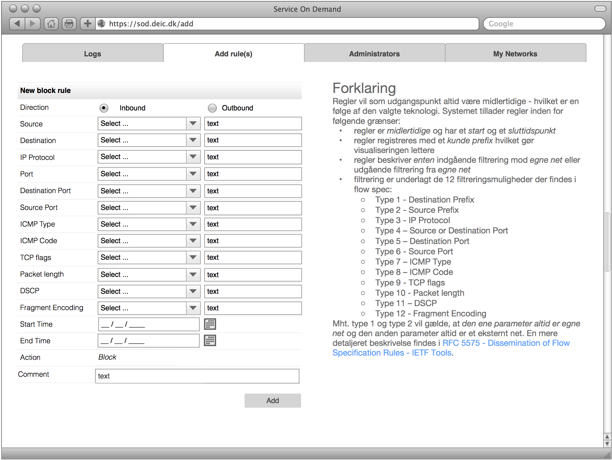

## FoD -- Firewall On Demand, version 1.0

_Et DeIC projekt_.

### Indledning

#### Beskrivelse
_Firewall On Demand_ skal være et _GUI_ værktøj til manuelt at at lave BGP flow
spec regler for egne net. Det bør ikke kaldes  _Firewall On Demand_: det giver
forkerte associationer: regler er ikke permanente og bør kun anvendes til
beskyttelse mod DDoS angreb, **ellers overbelastes udbydernes kant-routere**.

_FoD_ designes minimalistisk med anvendelse af så få software komponenter som
muligt og ved anvendelse af så gængs teknologi som muligt. Derved lettes
fejlsøgning og systemets eksterne afhængigheder begrænses.

**FoD** er tænkt som en central service for forskningsnet kunder og skal ses i
sammenhæng med det sideløbende projekt der gå ud på automatisk at imødegå DDoS
angreb ved hjælp af BGP flow spec.

#### Roadmap
I  versioner efter 1.0 vil der blive lagt vægt på følgende:

  - en administrativ grænseflade for kundehåndtering (oprettelse osv.) samt
    udtræk af databasen i forbindelse med fakturering (klargjort i version 1.0,
    se tabellen Customers) foruddefinerede valg i ved oprettelse af regler
    (>1024 erstattes med ``tcp-high-ports`` osv.)
  - _muligvis_ præ-definerede objekter for kendte net (_ikke_ f.eks. ``DK``)

Version 1.0 af FoD vil have en begrænset funktionalitet primært i brugergrænseflade delen og vil bestå af følgende komponenter:

  - En **database** der indeholder alle _FoD's_ komponenter og har følgende egenskaber:
    - _kunder_ med hver deres netværk og netværksadministratorer samt en administrator med database rettigheder
    - _kundenetværk_ på cidr form
    - _administratorer_ med rettigheder i forhold til filtrering mod et eller
	  flere af kundens netværk
  - En **Web baseret GUI**, bekrevet i det følgende
  - **hjælpe-scripts og programmer** til at:
	- indlæse output fra fra _fastnetmon_ (der til at begynde med sender direkte til [ExaBGP](https://github.com/Exa-Networks/exabgp))
	- udtræk af _regler_ der skal enforces via [ExaBGP](https://github.com/Exa-Networks/exabgp).

Derudover skal der laves følgende **infrastruktur** i forbindelse med projektet:

  - internt [RCF1918](https://tools.ietf.org/html/rfc1918) netværk mv.  beskyttet af en [pf firewall](https://en.wikipedia.org/wiki/PF_(firewall))
  - Apache web-server evt. med en [NGINX](https://nginx.org) front-end som ekstra sikkerhed.
  - [Postgress database](https://www.postgresql.org) idet den har indbygget [IPv6 og IPv4 data typer](https://www.postgresql.org/docs/9.1/static/datatype-net-types.html).

### Anvendelse
Arbejdsgangen vil normalt være, at kunders netværksadministratorer laver regler for blokkering af trafik mod kundens egne netværk eller blokkering af trafik fra kundens egne netværk via en web-baseret GUI og at _fastnetmon_ sender automatiske regler til databasen. (I første omgang sender fastnetmon _også_ selv flow spec opdateringer).

Reglerne skal læses hvert minut fra databasen og sendes via ExaBGP som BGP flowspec oplysninger til kant routere og uplink hvor de effektueres via _access lister_.

Regler vil som udgangspunkt altid være midlertidige - hvilket er en følge af den valgte teknologi. Systemet tillader regler inden for følgende grænser:

  - regler er _midlertidige_ og har et _start_ og et _sluttidspunkt_
  - regler registreres med et _kunde prefix_ hvilket gør visualiseringen lettere
  - regler beskriver _enten_ indgående filtrering mod _egne net_ eller udgående filtrering fra _egne net_
  - filtrering er underlagt de 12 filtreringsmuligheder der findes i flow spec:
      - Type 1 - Destination Prefix
      - Type 2 - Source Prefix
      - Type 3 - IP Protocol
      - Type 4 – Source or Destination Port 
      - Type 5 – Destination Port
      - Type 6 - Source Port
      - Type 7 – ICMP Type 
      - Type 8 – ICMP Code 
      - Type 9 - TCP flags
      - Type 10 - Packet length
      - Type 11 – DSCP
      - Type 12 - Fragment Encoding

Mht. type 1 og type 2 vil gælde, at _den ene parameter altid er egne net_ og den anden parameter altid er et eksternt net. En mere detaljeret beskrivelse findes i [RFC 5575 - Dissemination of Flow Specification Rules - IETF Tools](https://tools.ietf.org/html/rfc5575). Her står ligeledes præcist hvilket format hver parameter kan anføres i.
 
## Databasedesign

Databasedesignet er vedlagt (``dbcreate.sql``).

  - constrains er søgt lavet så fejl mv. i GUI'en ikke kan slå igennem i databasen
  - valgmuligheder / feltoplysninger så vidt muligt læses fra databasen

### Web baseret GUI

Den web-baserede GUI vil bestå af følgende komponenter:

  - En _kundevendt policy editor_ med mulighed for at
    1. *oprette*, *ændre* og *slette* regler der alle vil være meget BGP flowspec centriske
    2. *oprette*, *ændre* og *slette* *netværks*- og *service*-objekter (implementeres ikke i version 1.0)
    3. se en oversigt af blokkering for egne net (log)
    4. administration af netværksadministratorer med rettigheder i forhold til egne net (hvem må blokere adgang til bestemte net)

Det sidste punkt (4) kan evt. udskydes til senere. I oversigten (3) vil indgå både _manuelle regler_ oprettet i GUI'en og _automatiske regler_ lavet af [fastnetmon](https://github.com/pavel-odintsov/fastnetmon).

Jeg vil foreslå f.eks. 4 faneblade/knapper i toppen eller andet minimalistisk.

#### Administratorer

Administratorer findes i to kategorier:

  - _DBADMIN_: må oprette _NETADMIN_ administratorer og subnet for en kundes interne net samt lave regler for netværk
  - _NETADMIN_: må lave regler for bestemte netværk
 
_DBADMIN_ brugern oprettes samtidig med kunden; i version 1.0 ved at skrive direkte i databasen. 

For _DBADMIN_ brugeren gælder at:

  - brugeren kan ikke slettes
  - brugeren kan oprette, slette og tildele rettigheder til _NETADM_ brugere
  - brugeren har samme rettigheder som en _NETADM_ bruger, men uden begrænsninger

For _NETADM_ brugeren gælder at:

  - brugeren tildeles rettigheder for dét at lave blokkeringsregler for kundens enkelte net (cidr)
  - brugeren kan ikke slettes men gøres inaktiv

Det er fristende at udvide modellen til at NETADMIN må oprette subnet for egne
netværk, men det bliver hurtigt meget omstændigt og kan udelades.

Se tabellen _Administrators_ for hvilke felter der skal kunne udfyldes pr. administrator, idet der også skal være mulighed for at vælge _kundenetværk_ og tilføje dem til net, der må blokkeres af administratoren (tabellen _NetworkRights_). Det kunne f.eks. se sådan ud:

#### Netværks Objekter

Der vil fra start være et _cidr_ for hvert af en kundes netværk samt en række
prædefinerede service og ét netværksobjekt (Any), alle definerede i databasen.

Hver kunde kan kun se egne netværksobjekter.

I en fremtidig version bør man kunne vælge netværksobjekter fra en liste samt tilføje egne cidr'er for eksterne net man ønsker at blokkere trafik fra eller til. I version 1.0 skal netvæksadministratoren skrive cidr'en på eksterne net.

#### Service Objekter

Der vil fra start være en række prædefinerede serviceobjekter; f.eks. ``SMTP`` defineret som IP rotokol 17 (TCP) og port 25.

Det skal også være muligt at beskrive porte mv. med syntaksen fra [RFC 5575 - Dissemination of Flow Specification Rules - IETF Tools](https://tools.ietf.org/html/rfc5575).

#### Blokkeringsregler

Blokkeringsregler oprettes af en administrator (enten en DBADMIN eller en NETADMIN) på baggrund af netværksobjekter (interne og eksterne netværk eller subnet), service objekter samt et tidsrum en blokkeringsregel skal være gyldig.

Oprettelse af blokkeringsregler vil følge denne skabelon:

  1. tilføj regel: indgående ``ELLER`` udgående
  1. Vælg Source og Destignation:
    1. F.eks. fra en _pull down_ liste af brugerdefinerede netværksobjekter samt kundens netværk ``ELLER`` en specifik IP range ``ELLER`` en specifik IP adresse ``ELLER`` et globalt objekt.
  1. vælg service: Any ``ELLER`` præ-defineret ``ELLER`` brugerdefineret
    1. vælg præ-defineret fra f.eks. pull-down
	1. brugerdefineret: angiv TCP og/eller UDP samt port range, ``ELLER`` ICMP type og code ``ELLER`` TCP flag ``ELLER`` pakkestørrelse ``ELLER`` IP protokol.
  1. Angiv _start tid_ og _slut tid_.

Det kunne f.eks. se sådan ud:

Alle ICMP typer bør være med fra start som prædefinerede objekter (1 hhv 58) skal der kunne angives en ``TYPE`` og en ``CODE`` [se wikipedia](https://en.wikipedia.org/wiki/Internet_Control_Message_Protocol).

Grænseværdierne for alle legale valg skal læses fra tabellerne i databsen.

#### Brugerdefinerede serviceobjekter
Når brugeren vælger noget der ikke er defineret i forvejen (et af brugerens interne net eller f.eks. en prædefineret service som ``SMTP`` skal oplysningerne gemmes som et nyt objekt der vil kunne genbruges.  

Brugerdefinerede serviceobjekter skal indeholde følgende felter:

  - Service objektnavn, f.eks. RDP
  - IP protokol (255 numre, se [wikipedias artikel om IP numre](https://en.wikipedia.org/wiki/List_of_IP_protocol_numbers)). Det vil nok kun være en delmængde der er aktuel, brugeren skal vælge den fra en liste. ICMP bør ikke være her: det skal være prædefineret. Det samme for f.eks. GRE, og en lang række af de andre.
  - For UDP og TCP (6 og 17) skal der kunne anføres en (liste af) portnumre
  - En pakkestørrelse
  - TCP flag: se [Wikipedia om Transmission Control Protocol ](https://en.wikipedia.org/wiki/Transmission_Control_Protocol) - med en kortere [beskrivelse her](https://danielmiessler.com/study/tcpflags/)
  - En kort beskrivelse.

Dvs. der skal først vælges _IP protkol_ og for TCP og UDP skal der kunne vælges portnumre (en liste?) og for alle en pakkestørrelse. Et legalt brugervalg er f.eks. ICMP type 5 code 0 (_Redirect Datagram for the Network_) med en bestemt pakkestørrelse.

Objektet skal gemmes under kundens informationer.

Brugerdefinerede netværksobjekter skal indeholde følgende felter, idet de kan være _både interne og eksterne adresser_:

  - Netværks objektnavn, f.eks. WEB-DMZ
  - Netværk som [CIDR](https://en.wikipedia.org/wiki/Classless_Inter-Domain_Routing)
  - Kommentar
  - Hvilke administratorer der må lave regler for nettet

Heraf følger, at kun _super administratoren_ kan oprette nye netværksobjekter der er en delmængde af interne netværk; men det er nok lettere at vedtage det kun er super administratoren der kan oprette netværk overhovedet.  

#### Status

Opgaver fordelt: Database mv. primært FTH, lidt NTH. Infrastruktur: AMD, Web-gui: KSO. Dokumentation mv. NTH & NIE.

<html></html>

| Dato                          | Ændring     |
| ----------------------------- | ----------- |
| Tir 31 Maj 2016 19:08:06 CEST | Database mv. nogenlunde på plads incl. test data. Netværk og firewall ditto, virtuel maskine oprettet [Ubuntu Server LTS 16.04](releases.ubuntu.com/16.04)|

<html>
</html>
