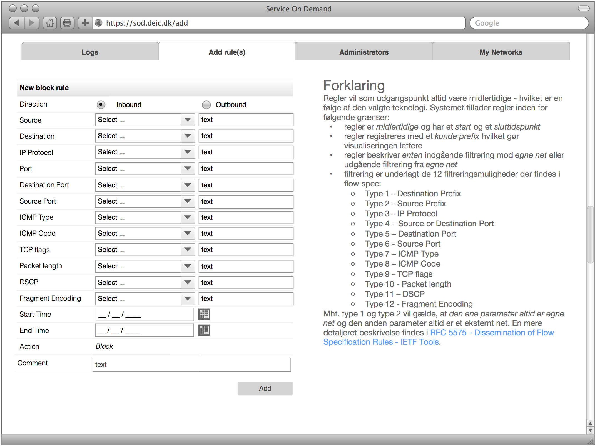

# DDPS

_DDPS skal være et _GUI_ værktøj til manuelt at at lave BGP flow
spec regler for egne net. Det bør ikke kaldes  _Firewall On Demand_: det giver
forkerte associationer: regler er ikke permanente og bør kun anvendes til
beskyttelse mod DDoS angreb, **ellers overbelastes udbydernes kant-routere**.

**SoD** er tænkt som en central service for forskningsnet kunder og skal ses i
sammenhæng med det sideløbende projekt der gå ud på automatisk at imødegå DDoS
angreb ved hjælp af BGP flow spec.

Reglerne beskrives via en web-baseret GUI og laves af en forskningsnet kundes
netværksadministrator. Reglerne bliver submittet via BGP flowspec og enforces
via _access lister_ i kantroutere på forskningsnet og de peering partnere der
tillader flow spec baseret filtrering.

Regler vil som udgangspunkt altid være midlertidige - hvilket er en følge af
den valgte teknologi. Systemet tillader regler inden for følgende grænser:

  - regler er _midlertidige_ og har et _start_ og et _sluttidspunkt_
  - regler registreres med et _kunde prefix_ hvilket gør visualiseringen lettere
  - regler beskriver _enten_ indgående filtrering mod _egne net_ eller udgående filtrering fra _egne net_
  - filtrering er underlagt de 12 filtreringsmuligheder der findes i flow spec:
      - Type 1 - Destination Prefix
      - Type 2 - Source Prefix
      - Type 3 - IP Protocol
      - Type 4 – Source or Destination Port 
      - Type 5 – Destination Port
      - Type 6 - Source Port
      - Type 7 – ICMP Type 
      - Type 8 – ICMP Code 
      - Type 9 - TCP flags
      - Type 10 - Packet length
      - Type 11 – DSCP
      - Type 12 - Fragment Encoding

Mht. type 1 og type 2 vil gælde, at _den ene parameter altid er egne net_ og
den anden parameter altid er et eksternt net. En mere detaljeret beskrivelse
findes i [RFC 5575 - Dissemination of Flow Specification Rules - IETF
Tools](https://tools.ietf.org/html/rfc5575).
 
_SoD_ version 1.0 vil rent teknisk bestå af følgende komponenter:

  - En database med alt indhold (intet i filsystemet)
  - En Web baseret GUI
  - scripts/programmer til
    - opdatering af databasen med _forskellige default objekter_,
	- log information fra _fastnetmon_ (rettes senere til også at være flow spec data)
	- udtræk af _regler_ der skal enforces via [ExaBGP](https://github.com/Exa-Networks/exabgp).

Der vil skulle laves en infrastruktur i forbindelse med projektet der skal omfatte følgende:
  - internt [RCF1918](https://tools.ietf.org/html/rfc1918) netværk mv.  beskyttet af en [pf firewall](https://en.wikipedia.org/wiki/PF_(firewall))
  - Apache web-server evt. med en [NGINX](https://nginx.org) front-end som ekstra sikkerhed.
  - [Postgress database](https://www.postgresql.org) idet den har indbygget [IPv6 og IPv4 data typer](https://www.postgresql.org/docs/9.1/static/datatype-net-types.html).

## Databasedesign

Databasedesignet findes [her](../dbinit.sql).

## Web baseret GUI

Den web-baserede GUI vil bestå af følgende uafhængige komponenter:

  - En _kundevendt policy editor_ med mulighed for at
    1. oprette, ændre og slette regler
	2. oprette, ændre og slette _netværks_- og _service_-objekter
	3. se en oversigt af blokkering for egne net
	4. administration af netværksadministratorer med rettigheder i forhold til egne net (hvem må blokere adgang til bestemte net)

Det sidste punkt (4) kan evt. udskydes til senere. I oversigten (3) vil indgå både _manuelle regler_ oprettet i GUI'en og _automatiske regler_ lavet af [fastnetmon](https://github.com/pavel-odintsov/fastnetmon).

### Administratorer

Administratorer findes i to kategorier:
  - DBADMIN: må oprette _NETADMIN_ administratorer og subnet for en kundes interne net samt lave regler for netværk
  - NETADMIN: må lave regler for bestemte netværk

Det er fristende at udvide modellen til at NETADMIN må oprette subnet for egne
netværk, men det bliver hurtigt meget omstændigt og kan udelades.

### Netværksobjekter

Der vil fra start være et _cidr_ for hvert af en kundes netværk samt en række
prædefinerede service og eksterne netværksobjekter, alle definerede i databasen.

Hver kunde kan kun se egne netværksobjekter.

Der vil derudover være følgende netværksobjekter:

  - Any: dvs alle netværk undtagen egne
  - Forskningsnet: _vores_ netværk
  - Net baseret på landekoder, f.eks. ``DK``.

### Serviceobjekter

Der vil fra start være en række prædefinerede serviceobjekter; f.eks. ``SMTP``
defineret som IP protokol 17 (TCP) og port 25.

### Blokkeringsregler

Blokkeringsregler oprettes af en administrator (enten en DBADMIN eller en
NETADMIN) på baggrund af netværksobjekter (interne og eksterne netværk eller
subnet), service objekter samt et tidsrum en blokkeringsregel skal være
gyldig.

Oprettelse af blokkeringsregler vil følge denne skabelon:

  1. tilføj regel: indgående ``ELLER`` udgående
  1. Vælg Source og Destignation:
    1. F.eks. fra en _pull down_ liste af brugerdefinerede netværksobjekter samt kundens netværk ``ELLER`` en specifik IP range ``ELLER`` en specifik IP adresse ``ELLER`` et globalt objekt.
  1. vælg service: Any ``ELLER`` præ-defineret ``ELLER`` brugerdefineret
    1. vælg præ-defineret fra f.eks. pull-down
	1. brugerdefineret: angiv TCP og/eller UDP samt port range, ``ELLER`` ICMP type og code ``ELLER`` TCP flag ``ELLER`` pakkestørrelse ``ELLER`` IP protokol.
  1. Angiv _start tid_ og _slut tid_.

Det kunne f.eks. se sådan ud:

Alle ICMP typer bør være med fra start som prædefinerede objekter (1 hhv 58) skal der kunne angives en ``TYPE`` og en ``CODE`` [se wikipedia](https://en.wikipedia.org/wiki/Internet_Control_Message_Protocol).

Grænseværdierne for alle legale valg skal læses fra tabellerne i databsen.

### Brugerdefinerede serviceobjekter
Når brugeren vælger noget der ikke er defineret i forvejen (et af brugerens interne net eller
f.eks. en prædefineret service som ``SMTP`` skal oplysningerne gemmes som et nyt objekt der vil kunne genbruges.

Brugerdefinerede serviceobjekter skal indeholde følgende felter:

  - Service objektnavn, f.eks. RDP
  - IP protokol (255 numre, se [wikipedias artikel om IP numre](https://en.wikipedia.org/wiki/List_of_IP_protocol_numbers)). Det vil nok kun være en delmængde der er aktuel, brugeren skal vælge den fra en liste. ICMP bør ikke være her: det skal være prædefineret. Det samme for f.eks. GRE, og en lang række af de andre.
  - For UDP og TCP (6 og 17) skal der kunne anføres en (liste af) portnumre
  - En pakkestørrelse
  - TCP flag: se [Wikipedia om Transmission Control Protocol ](https://en.wikipedia.org/wiki/Transmission_Control_Protocol) - med en kortere [beskrivelse her](https://danielmiessler.com/study/tcpflags/)
  - En kort beskrivelse.

Dvs. der skal først vælges _IP protkol_ og for TCP og UDP skal der kunne vælges portnumre (en liste?) og for alle en pakkestørrelse. Et legalt brugervalg er f.eks. ICMP type 5 code 0 (_Redirect Datagram for the Network_) med en bestemt pakkestørrelse.

Objektet skal gemmes under kundens informationer.

Brugerdefinerede netværksobjekter skal indeholde følgende felter, idet de kan
være _både interne og eksterne adresser_:

  - Netværks objektnavn, f.eks. WEB-DMZ
  - Netværk som [CIDR](https://en.wikipedia.org/wiki/Classless_Inter-Domain_Routing)
  - Kommentar
  - Hvilke administratorer der må lave regler for nettet

Heraf følger, at kun _super administratoren_ kan oprette nye netværksobjekter
der er en delmængde af interne netværk; men det er nok lettere at vedtage det
kun er super administratoren der kan oprette netværk overhovedet.

### Status

Opgaver fordelt: Database mv. primært FTH, lidt NTH. Infrastruktur: AMD, Web-gui: KSO. Dokumentation mv. NTH & NIE.

| Dato                          | Ændring     |
| ----------------------------- | ----------- |
| Tir 31 Maj 2016 19:08:06 CEST | Database mv. nogenlunde på plads incl. test data. Netværk og firewall ditto, virtuel maskine oprettet [Ubuntu Server LTS 16.04](releases.ubuntu.com/16.04)|

