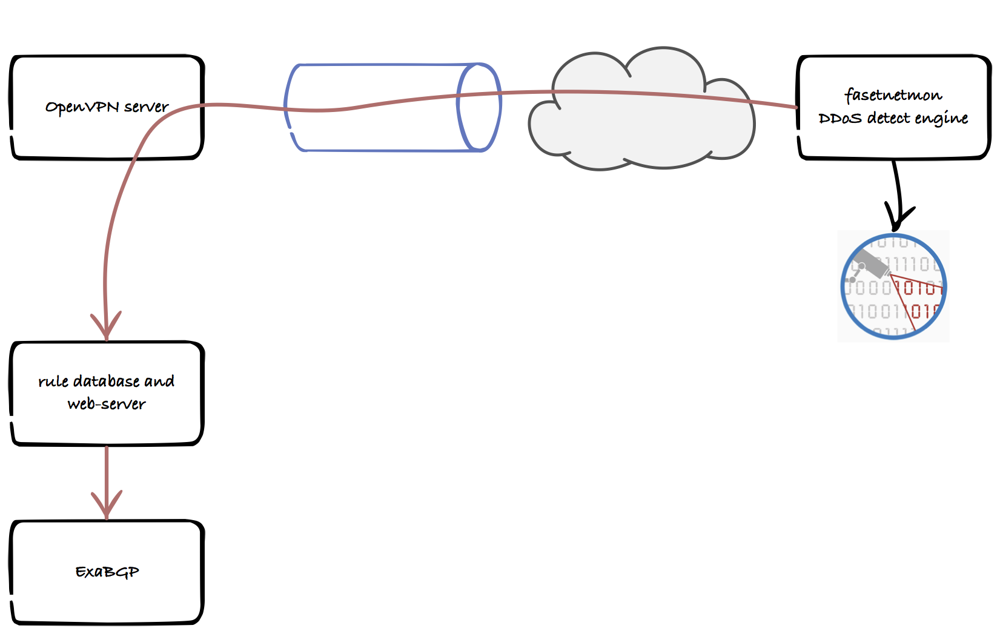
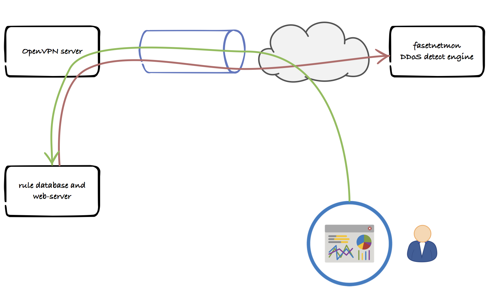

# Network configuration

The simple configuration is this:

  - _the site_ with the database, web-server etc. ``ddps database host``
  - an OpenVPN server (and firewall) in front of the site with the database,
    web-server etc.
  - a finite number of detectors based on _fastnetmon_ and _influxdb_ - ``fnm``
    each with an embedded OpenVPN client configuration
  - a larger number of _network administrators_ with access to _the site_
    through OpenVPN connections

Access to the _fastnetmon_ instances is limited, so is access to _the site_.

Between _the site_ and each _fastnetmon_ instances is LAN to LAN connection
based on OpenVPN. This is a two way network connection.

Each administrator is given _an OpenVPN configuration_ and _credentials for_
_accessing the database host with https only_. This does not give access to the
fastnetmon hosts.

The system does not relay on external authentication e.g.
[WAYF](www.wayf.dk/en/about-wayf/faq); we require strict control on users and
their access and cannot rely on network authentication during an infrastructure
attack.

The red lines on the drawing represents ssh connections; they may be
established in both directions but on the drawing it just shows what happens
when _fastnetmon_ detects an attack.

The blue tube represents an OpenVPN tunnel between a virtual interface on the
fastnetmon host and an OpenVPN server.

The ssh connection passes the tunnel from the fastnetmon host to the database
server. The database server communicates with the ExaBGP instances over an
other SSH tunnel.

## Deployment of the fastnetmon host

The fastnetmon host is physical, currently based on low budget Super Micro
AX10SLL-F 1U host with 3 interfaces

  - One 10G interface for port mirroring connected to the customers switch or router
  - One 1G interface connected to LAN, DSL or something else. IP via DHCP. The OpenVPN connection is bound to this interface

The IP configuration is based on
[DHCP](https://en.wikipedia.org/wiki/Dynamic_Host_Configuration_Protocol) which
will give the host an IP address, DNS and NTP configuration (depending on the
DHCP server configuration).

The fastnetmon host will be shipped with an unique OpenVPN client
configuration: each fastnetmon hosts will have their own IP address supplied by
the OpenVPN server, certificate etc. The IP address configured by the OpenVPN
server has to match the one in the database. The fastnetmon hosts will all have
the same configuration settings for the ssh server, iptables etc. Once the
fastnetmon host is installed the customer specific configuration for fastnetmon
etc. may be supplied from the database e.g. using ssh. 

The customer will not have access to the host.

In short: they are all identical and centrally managed.

## Administrator access

Besides the build-in access model which allows for e.g. Anders to have access to
rules for all networks - thereby enabling him to bypass all rules - the following
techniques are used:

 -  Each administrator must have an OpenVPN client installed with a specific configuration
 -  Access to the database and web server is limited to addresses used by the OpenVPN server.

The administrator starts the OpenVPN client, then the browser and connect to
the database and web-server and log in.

The green line on the drawing is the administrators SSL connection (browser)
while the red line is still an ssh, http or other kind of connection used by
the server application to retrieve data from the influxdb.

The administrator would like see at least the following:

  - rules: available from the database on the database host
  - statistic of all kind: this have to be read on demand from an influxdb on
    the fastnetmon hosts owned by the administrator

So a server side application must query the database for rules and connect
using ssh to each of the administrators fastnetmon hosts for data stored in
influxdb and present everything to the administrator.

We avoid large amount of network traffic by keeping the network statistic from
fastnetmon in a local influxdb and only request it on demand. The influxdb is
a round robin database with a fixed limit on how long data is preserved.

Having e.g. SSL inside OpenVPN is encryption in encryption but has other benefits:

  - there is no access to the web-server unless you are already authenficated
    in the tunnel thereby the attack vector on the server
  - we can add the OpenVPN later without changing anything to the current
    network topology.

