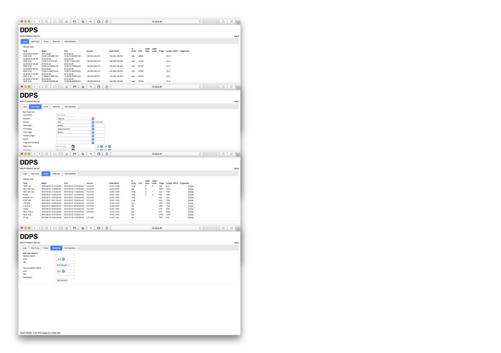
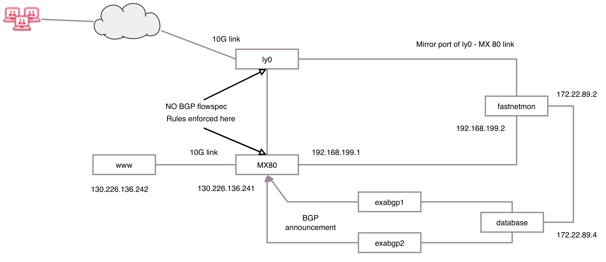
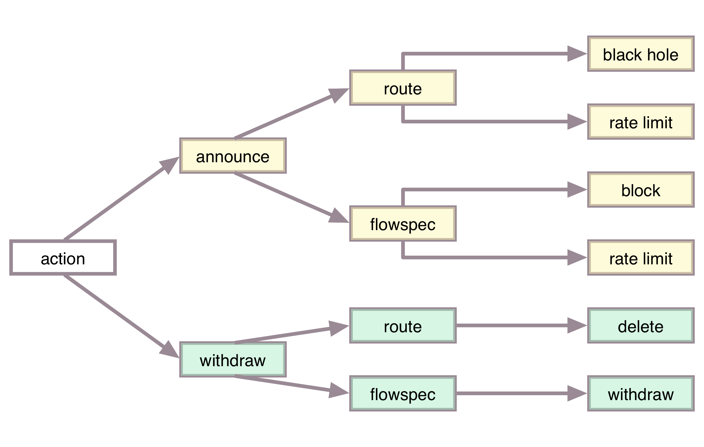
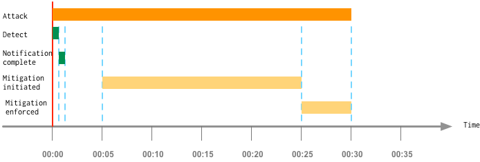
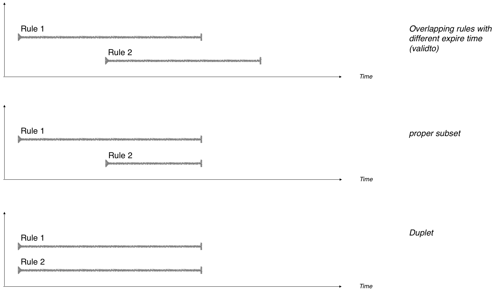

## Version 1.0 [version 1.0]

See project description. We are heading towards real-life testing on version
1.0 in liaison with Nordunet; a meeting is scheduled to September 30.

Mitigation rules are created either _automatic_ or by a network operator
using a Web-UI. The Web-UI is shown below:

All rules are saved to the same database.

 &nbsp;

### Network test setup
Fastnetmon detects the attack, and informs the database of the event.
Information from the database is converted to mitigation rules, which are
announced using BGP flow spec via 2 x ExaBGP and enforced on a Juniper MX 80.

### Automatic mitigation
The design for the automatic mitigation and withdraw is shown on the graph.
The design supports both route based and BGP flowspec based mitigation and
withdraw.

<html>
 &nbsp;
</html>
#### Time line during attack

The attack is detected as it starts, and the database is updated with the
relevant information within seconds.         
The database is queried for new rules every 20 seconds (configurable) and
mitigation rules are injected in ExaBGP immediately after.

The longest time before mitigation is in place is roughly 30 seconds from the
attack is initiated.

### Components and attack simulation

We can simulate an attack (a real attack disrupts our network) from the fastnetmon
host, through the database and to the exabgp hosts.

#### Fastnetmon:

Status:
: Installed and in working condition, performance tests and limitations for the current hardware configuration outstanding.

Server installed as:

  - OS: Debian GNU/Linux 8
  - [fastnetmon](https://github.com/pavel-odintsov/fastnetmon)
  - ``fnm2db``: Perl script triggered by fastnetmon which sends attack info to the database

Pseudo code for ``fnm2db``:

	if [ invalid argument OR argument is unban ]
	{
		exit
	}
	while read tcpdump from stdin
	{
		process 47 parameters
	}
	read configuration file || fail
	build sql statement
	if [ connect to database and insert flowspec rules ]
	{
		exit OK
	}
	else
	{
		exit FAIL
 	}

<html>
 &nbsp;
</html>
#### ddps:

Status:
: Installed and in working condition. Daemon running as expected and without memory leaks.

Server installed as:

  - OS: Ubuntu 16.04.1 LTS
  - [postgres](https://www.postgresql.org), OS version
  - ``db2dps``: Daemon which reads the database for rules and send enforcement and withdraw statements to remote ExaBGP's
  - ``Web-UI``: Work in progress

Pseudo code for ``db2dps``:

	read configuration || fail
	check args, and EITHER run as daemon OR run in foreground

	while true; 		# continue loop starts here
	{
		if [ we should exit ]
		{
			exit
		}
		 else {
			sleep except on first loop
		}
		connect to database || exit fail
		For each bgp-host do
		{
			open ssh configuration to bgp-host || continue
			if [ a full feed is required ]
			{
				query all records || continue
			}
			else {
				query for NOT isactivated and NOT expired records
			}
			for each record do {
				convert record to rule usable by bgp-host
				send rule to bgp-host with ssh
				preserve record id for isactivated record
			}
		}
		query for expired AND isactivated records
		for each record do {
			send delete rule to bgp-host
			preserve record id for expired record
		}
		close ssh connection
		if [ ! status ok ]
		{
			warn about ssh faileure
		}
	
		update database with all isactivated records || warn
		update database with all expired records     || warn
	}

#### exabgp1 and exabgp2

Status:
: None of the servers are installed.

  - OS: Ubuntu 16.04.1 LTS
  - Latest version of [exabgp](https://github.com/Exa-Networks/exabgp), not OS version

#### Document version:

         $Id: 36bd5c5661a302eb0c1a2c613a9ca80cb6cdd9a6 $

<html>
<!-- 
#### Notice about this documentation

The text is written in [markdown](https://en.wikipedia.org/wiki/Markdown) and
rendered to html with [mulitmarkdown](fletcherpenney.net/multimarkdown) using
an internal [css](https://en.wikipedia.org/wiki/Cascading_Style_Sheets),
converted to pdf with [wkhtmltopdf](http://wkhtmltopdf.org) while the images
currently are made with [diagramix](diagrammix.com), an inexpensive OS X software.
Everything is kept in [textbundle format](textbundle.org) and lives within the
[git server of ssi.i2.dk](http://gitlab.ssi.i2.dk).

-->
</html>

# Status on DeIC DPS, 2016, October 14

  - Found but yet not implemented a solution with delete of rules under rare
    circumstances: identical rules with different length (time) may be deleted
  - when the shortest rule expire
  - Asked and search if it is possible to set an expire time on statements to
    exabgp but not found anything conclusive yet. An expire time would solve
    the problem above (by doing nothing)

## Status unchanged

Anders and Hugge will do the configuration. We have a spare 10G connection
which will be used for the test. The connection is from the abandoned autobahn
project.

## Redundant rules, sort-of

Some rules may show up as _redundant_ when enforced in exabgp. The rules has 12
properties in the database together with meta information including expire
time, if the rule is enforced etc.

Most of the information is stripped from the rule once it is enforced in
exabgp. As of version 1.0 only destination CIDR and port or icmp is used.

Cleaning up the _announcing_ of redundant rules is left to exabgp, but the
_withdraw_ of redundant rules with different expire time may cause problems, as
the expire time needs to be taken into account.

Looking at the tree different scenario's only the first causes real problems.
The two rules differers only on expire time.

I think that by sorting on _expire time_ first (and all other database
parameters afterwards) it will be easy to match rules with an expire time
greater than ``now()`` and therefore avoid expiring all other nearly matching
rules.

