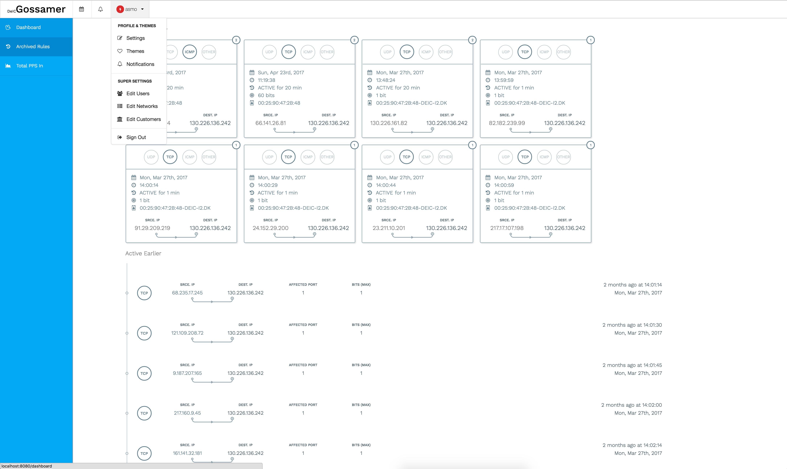
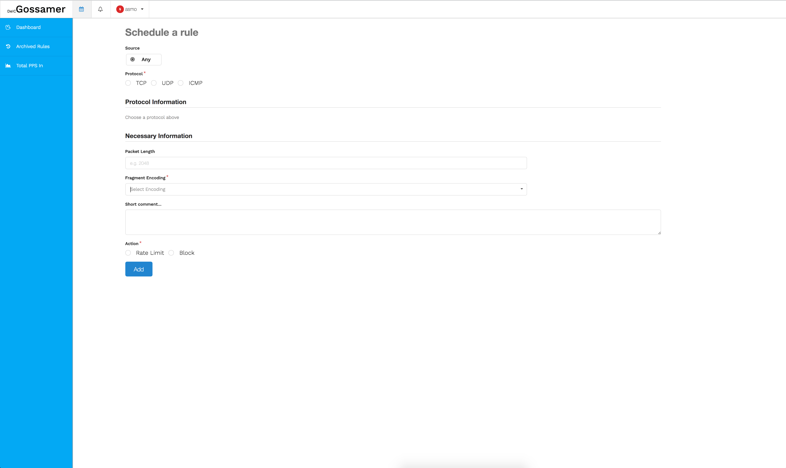

# DeiC DDPS

DeiC Distributed Denial of Service Attack Prevention System.

## System Objective

  - Volumetric attack mitigation
  - Proactive configuration
  - Fast reacting automatic mitigation
  - Fail safe with a kill switch
  - Self service with WAIF integration
  - Don't waste money

## Solutions

| Arbor Networks or similar | Home made       |
| ------------------------- | ----------------|
| <ul><li>Outrageous expensive<li>standard solution<li>requiring certified staff</ul> | <ul><li>well understood code<li>integrated with e.g WAYF<li>limited functionality</ul> |

## System description

### Components

Will be available on github.com

#### Backend

  - db2dps
  - database
  - OS configuration: (sftp)-users etc.

#### automatic detect engine

  - fastnetmon
  - 10Gb drivers
  - notification script, ssh keys etc.

#### GUI

  - Policy editor
  - Archived rules viewer
  - Current and past status view (data from influx db)
  - Correlation between _archived rules_ and _past data_
 
#### Enforcement

  - 2 x exabgp sending rules to Juniper MX-80 and Juniper 960, later to Nordnet as well
 
#### Security and tunnels

  - OpenVPN based access; client and IPSec tunnels

#### Deployment tools

  - ssh key management
  - database data export to configuration files

#### User management

  - WAIF integration
  - OpenVPN configurations
  - SSH keys

#### Collaboration tools

  - upload rules with [sftp](https://en.wikipedia.org/wiki/SSH_File_Transfer_Protocol)

## Status

  - experimental and not in yet production
  - rule optimisation still rudimentary
  - GUI
  - Wrap everything in VPN (database and fastnetmon instances on network with NAT)
  - WAYF integration

## Attack walk through with automatic mitigation

### The attack

A simple attack: syn flooding with randon source:

	hping3 130.226.136.242 -I eth1 -q -n --syn --data 120 --destport 80 --flood --rand-source

### Detection

  - Attacks are detected by fastnetmon
  - the flow triggers a rule creation
  - the rule file(s) are uploaded to a database host.

Rule file format:

    Rule header: type;vesion;attack_info
       type:        | fnm ...
       optimization | doop | noop | opop
       version:     | 1 ...
       attack_info: | icmp_flood | syn_flood | udp_flood | unknown | ...

       Rules: customernetworkid,uuid,fastnetmoninstanceid,administratorid,blocktime,1,2,3,4,5,6,7,8,9,10,11,12
       customernetworkid:      Customer id (int)
       uuid:                   Mac address -- identify fastnetmon instance
       fastnetmoninstanceid:   Customers fastnetmon # (int)
       administratorid:        Administrator id (int)
       blocktime:              Minutes
       Type 1 - Destination Prefix
       Type 2 - Source Prefix
       Type 3 - IP Protocol
       Type 4 – Source or Destination Port
       Type 5 – Destination Port
       Type 6 - Source Port
       Type 7 – ICMP Type
       Type 8 – ICMP Code
       Type 9 - TCP flags
       Type 10 - Packet length
       Type 11 – DSCP
       Type 12 - Fragment Encoding
       last-line

E.g.

       head;fnm;doop;1;syn_flood
       0;00:25:90:47:2b:48;1;42;10;130.226.136.242;66.141.26.81;tcp;14372;80;80;null;null;syn;60;63;null;0
       0;00:25:90:47:2b:48;1;42;10;130.226.136.242;161.185.77.224;tcp;14374;80;80;null;null;syn;60;63;null;0
	   ....
	   ...
	   .
       last-line	

### Mitigation

  - rules are uploaded to a database server with sftp
  - analysed inserted in a database 
  - extracted and enforced

#### Rule creation

From ~ 100.000 lines to 1

| Attack type            | Mitigation tactics     | Match on    |
| :--------------------- | :------------- | :---------- |
| syn_flood              | rate-limit     | tcp option (syn) protocol, destination port, tcp flags, size, (ttl w   ould be nice but [is still in draft](https://tools.ietf.org/id/draft-ietf-idr-bgp-flowspec-label-00.txt)), and s   ource any  |
| udp_flood              | rate-limit     | protocol and destination host and port  |
| icmp flood             | discard        | protocol and destination  |
| ip_fragmentation_flood | rate-limit     | protocol and destination  |
| DNS amplification      | rate-limit     | protocol, port and destination |
| NTP amplification      | rate-limit     | protocol, port and destination |
| SSDP amplification     | discard        | protocol, port 1900, source any |
| SNMP amplification     | discard        | protocol, port, destination     |

Automatic generated rules has a configurable expire time - same time for all rules from one instance.

Manuel created rules (GUI) may have pr rule expire time.

## Enforcement

Reading rules from the database

	read:  2667,in,130.226.136.242,'',tcp,80,80,'','','',syn,174,'','',rate-limit 9600,2017-05-17 12:48:51.498429+02,2017-05-17 12:58:51.498429+02

Convert rule to flowspec

	rule: announce flow route 2677 { match {  destination 130.226.136.242/32; destination-port 80; protocol tcp; tcp-flags syn; packet-length 174; } then { rate-limit 9600 } } }

## Due diligent mitigation

Require GUI access (VPN, WAYF) and authorisation 

  - knows a system will most likely come under attack on specific time
  - create mitigation rules ahead of e.g. national tests
  - advanced filtering e.g. block UDP and GRE to web-server, all TCP ports below and above 443
  - monitoring rules | history of attacks (graphs)

and

Notice the local firewall is of no use mitigating volumetric attacks.

## Final thoughts 

  - fail safe: 
    - do nothing upon data failure
	- rules are limited to our networks (all the way through the system)
